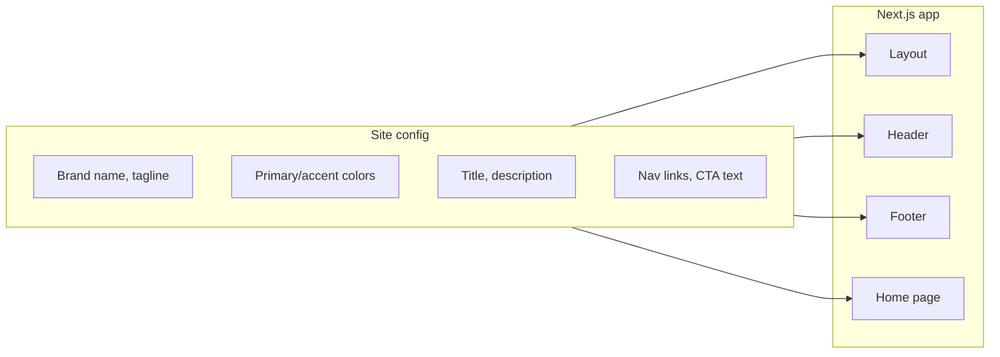

# Template and SEO Strategy

Two separate tracks: how to reuse the landing "skeleton" as a template, and how to approach SEO.

---

## Part 1: Turning the site into a reusable template

### What the skeleton is today

The current stack is a single Next.js app with:

- **Layout**: [app/layout.tsx](app/layout.tsx) — root layout, skip link, Header, Footer, AccessibilityWidget, Heebo font, `lang="he"` / `dir="rtl"`.
- **Design system**: [app/globals.css](app/globals.css) — CSS variables (primary, accent, alert, etc.), Tailwind theme, a11y font-size/contrast.
- **Shell components**: [Header](components/Header.tsx), [Footer](components/Footer.tsx) — brand name "Regulon", nav links, CTA, tagline hardcoded.
- **Home page**: [app/page.tsx](app/page.tsx) — hero, authorities carousel, audit section (upload + results + waitlist), features, trust, support button. All copy and section order are inline.
- **Static pages**: about, contact, pricing, privacy, accessibility — stub or full content, each with its own `metadata`.
- **Optional backend**: waitlist (Turso, rate limit, admin), middleware (Basic Auth). These are feature-specific.

To reuse this for "multiple landing pages" (other products or side projects), you need to separate **brand/copy/theme** from **structure and behavior**.

### Recommended approach: config-driven starter repo

**Idea:** One "landing template" repo (or a dedicated branch/tag in this repo) that new projects clone. Customization is done via a **single site config** plus swapping a few sections if needed.

**1. Introduce a site config module**

- Add something like `lib/site-config.ts` (or `config/site.json` + loader) that exports:
  - **Brand**: `siteName`, `tagline`, `logoIcon` (e.g. `"shield"`), optional `logoImage`.
  - **Meta**: `defaultTitle`, `defaultDescription`, optional `ogImage`.
  - **Theme**: optional overrides for `--primary`, `--accent` (or keep CSS vars and only set them from config at build time).
  - **Locale**: `lang`, `dir` (so the same codebase can do LTR/English later).
  - **Nav**: array of `{ label, href }` for header/footer; primary CTA `{ label, href }` (e.g. `/#audit` or external).
  - **Footer**: tagline, social links, optional columns.
- Keep defaults that match current Regulon so this repo stays valid as-is.

**2. Refactor shell components to use config**

- **Layout**: Read `defaultTitle`, `defaultDescription`, `lang`, `dir` from config; set `<html lang={} dir={}>` and `metadata`.
- **Header**: Logo + site name, nav links, and primary CTA from config. Keep the same layout and styles.
- **Footer**: Brand, tagline, nav columns, social links from config.

**3. Home page: config + optional sections**

- **Hero**: Headline, subheadline, CTA labels, eyebrow text — from config or from a "content" slice (e.g. `config.hero`).
- **Audit + waitlist**: Either keep as the default "tool + waitlist" block, or make it optional (e.g. `config.features.audit` / `config.features.waitlist`). For a different product you might replace this with a simple contact form or a different CTA.
- **Authorities carousel**: Optional; content from config (list of names or hide section).
- **Features / trust**: Could stay as placeholder sections with config-driven headings, or stay hardcoded for the template and you edit when cloning.

**4. How you use it for new landing pages**

- **Option A — Clone and customize**: Clone the template repo, edit `lib/site-config.ts` (and optionally `globals.css` theme), then replace hero/features copy in the home page and static pages. Remove or add sections (e.g. drop waitlist, add blog) as needed.
- **Option B — Scripted scaffold**: A small script (e.g. `create-landing.js` or `npm create @yourscope/landing`) that prompts for site name, tagline, primary color, then copies the template and writes the config. You run it once per new project.

**5. What to document**

- **README section**: "Using this as a template" — list the config keys, where copy lives, how to add/remove the waitlist and audit section, and how to deploy (e.g. Vercel with env for Turso if waitlist is used).
- **Optional**: A `template/` or `skeleton/` branch with Regulon-specific content stripped to minimal placeholder copy, so "clone from skeleton" is one command.

**Summary (template)**

| Step | Action                                                                                 |
| ---- | -------------------------------------------------------------------------------------- |
| 1    | Add `lib/site-config.ts` (or equivalent) with brand, meta, theme, nav, footer, locale. |
| 2    | Refactor layout, Header, Footer to consume config.                                     |
| 3    | Refactor home hero (and optionally other sections) to use config.                      |
| 4    | Document "clone and customize" and optional scaffold script.                           |
| 5    | Optionally create a minimal-content branch for clean clones.                           |

No need for a monorepo or multiple apps unless you want to maintain several sites in one repo; a single config-driven template is enough for multiple ideas and side businesses.

---

## Part 2: SEO approach

You don’t have to do everything at once. A simple order: **technical and on-page first**, then **content (articles/keywords)** when you’re ready.

### 1. Technical SEO (foundation)

- **Already in place**: Next.js SSR, one main page with clear structure, layout metadata (title, description), semantic sections and headings, internal links (nav, footer), skip link and a11y.
- **Worth adding when you touch the project**:
  - **Open Graph and Twitter cards**: In [app/layout.tsx](app/layout.tsx) (or per-page), add `openGraph` and `twitter` to Next.js `metadata` so shares show a proper title, description, and image.
  - **Sitemap**: `app/sitemap.ts` (or static `public/sitemap.xml`) listing `/`, `/about`, `/contact`, `/pricing`, `/privacy`, `/accessibility`. Helps discovery.
  - **robots.txt**: Allow crawling (and point to sitemap). Next.js can serve this via `app/robots.ts` or a static file in `public/`.
- **Performance**: Your PRD already targets LCP, INP, CLS. Keep images optimized (WebP/AVIF when you add more assets) and avoid blocking scripts. No code change needed for the current text-heavy page.

### 2. On-page SEO (what’s on each URL)

- **Home**: You already have a single H1, logical H2s, and meta title/description. Ensure the title and description include the main value proposition and 1–2 natural keywords (e.g. "תיק מוצר", "Code 65", "יבואנים").
- **Static pages**: Each has a title; add a short meta description if missing. Privacy and accessibility can stay thin; about/contact can have a sentence or two that reinforce the product and keywords.
- **Structured data (optional)**: Add JSON-LD for `Organization` (and optionally `WebSite`) so search engines understand the brand and domain. Can be added once in layout or a dedicated component.

You do **not** need a blog to improve core rankings for the main landing page. Technical + on-page is enough to compete for brand and close-to-product queries.

### 3. Content and keywords (when you want to grow traffic)

- **Do you need articles?** Only if you want to rank for more than "Regulon" and "product file Israel" type queries. Articles (blog or "resources") help with:
  - Long-tail queries (e.g. "מה זה Code 65", "איך מכינים תיק מוצר").
  - Building topical authority and backlinks.
- **How to approach it**:
  1. **Keyword sense-check**: Use Google (or a simple keyword tool) to see what people search (e.g. "תיק מוצר", "Code 65 יבוא", "הצהרת תאימות"). Pick 3–5 phrases that match your product.
  2. **Pillar pages**: Write 1–3 substantive pages that answer those queries (e.g. "מהו Code 65 ולמה זה רלוונטי ליבואנים", "איך מכינים תיק מוצר"). Keep them on your domain (e.g. `/blog/...` or `/resources/...`), link from the home or nav, and link to the main CTA.
  3. **No need to over-produce**: A few strong, useful pages beat many thin posts. You can add more later.
- **Where in the template**: If the template has a "blog" or "resources" section, it can be a simple list of links to MDX or CMS-driven pages. The template doesn’t have to include content strategy; it only needs a place to add pages and a clear URL structure.

**Summary (SEO)**

| Priority   | What to do                                                                                                                 |
| ---------- | -------------------------------------------------------------------------------------------------------------------------- |
| Now / next | Technical: OG/Twitter meta, sitemap, robots.txt. On-page: good title/description and H1/H2 on key pages; optional JSON-LD. |
| Later      | Content: 3–5 target keywords, 1–3 pillar articles, link to product. No obligation to do this before launch.                |

---

## Suggested order of work

- **Template**: Implement the site config and refactor layout/Header/Footer (and optionally hero) when you’re ready to spin up a second landing page. Document "how to clone and customize" in the README. Optional: scaffold script or skeleton branch.
- **SEO**: Add OG/Twitter, sitemap, and robots in a small PR. Refine meta and add JSON-LD if you want. Treat blog/keyword content as a separate, later phase once the main page and template are stable.

If you tell me which you want to do first (template extraction vs. SEO technical), I can break that part into concrete file-level steps and implementation tasks.